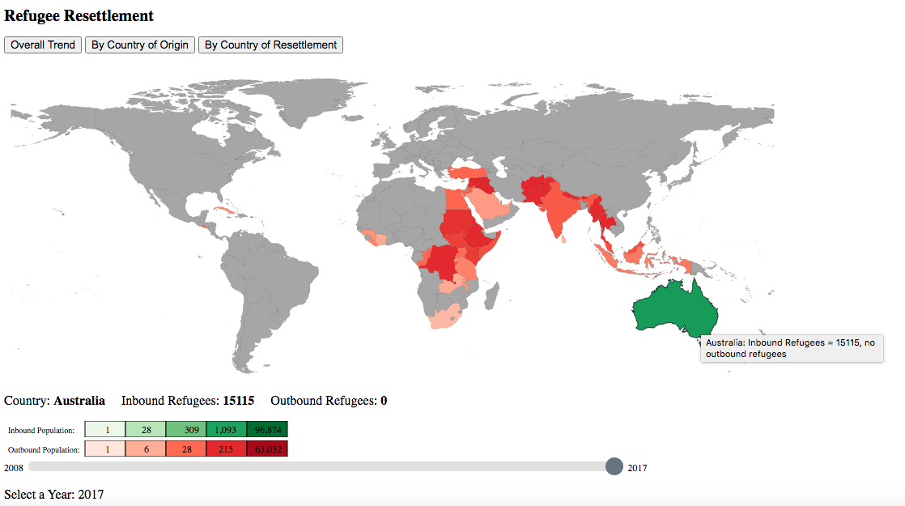

# Refugee Resettlement Visualization from 2008-2017
This visualization is designed to show movement and trends of refugee resettlement between countries of origin and countries of resettlement during the decade 2008-2017. For the "By Country of Origin" and "By Country of Resettlement" views the origin or resettlement data is initially shown for each country that has data in that category. Hovering over a country that was the origin of refugees in that particular year will display all of the countries that refugees from that country resettled in. The inverse is true for the "By Country of Resettlement" map. The year can also be changed on these views, and the data will be updated.

A legend showing the two color scales used in the visualization is shown at the bottom of the screen. Hovering over a color will display the value category it represents as a tooltip. The color scale is based on the minimum, maximum, 25th, 50th, and 75th percentiles of the total refugee data in each category.

##### Data sources: 
Refugee data is sourced from the UNHCR data at http://popstats.unhcr.org/en/resettlement. The variables included in the visualization are years (2008 - 2017), countries of origin, and countries of asylum. The json file used to create country paths was sourced from https://geojson-maps.ash.ms/.

##### How to run: 
While in the directory that contains the map files, run 'python3 -m http.server', then navigate to localhost:8000 in a web browser. Select map.html to view. The overall data for the year 2017 will initially be displayed. You can switch between maps using the buttons at the top of the screen. 

##### Files contained in this directory:
map.js
map.html
default.csv - data used in "Overall Trend" map
rawdata.csv - data used for ""By Country of Origin" and "By Country of Resettlement" maps
custom.geo.json- json file for country shapes
finalProjectWriteUp - a pdf contains descriptions and screenshots of our visualizations

##### Screenshot:

## Authors: 
Claudia Naughton, Yingying Wang
CS314 Carleton College
